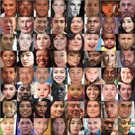
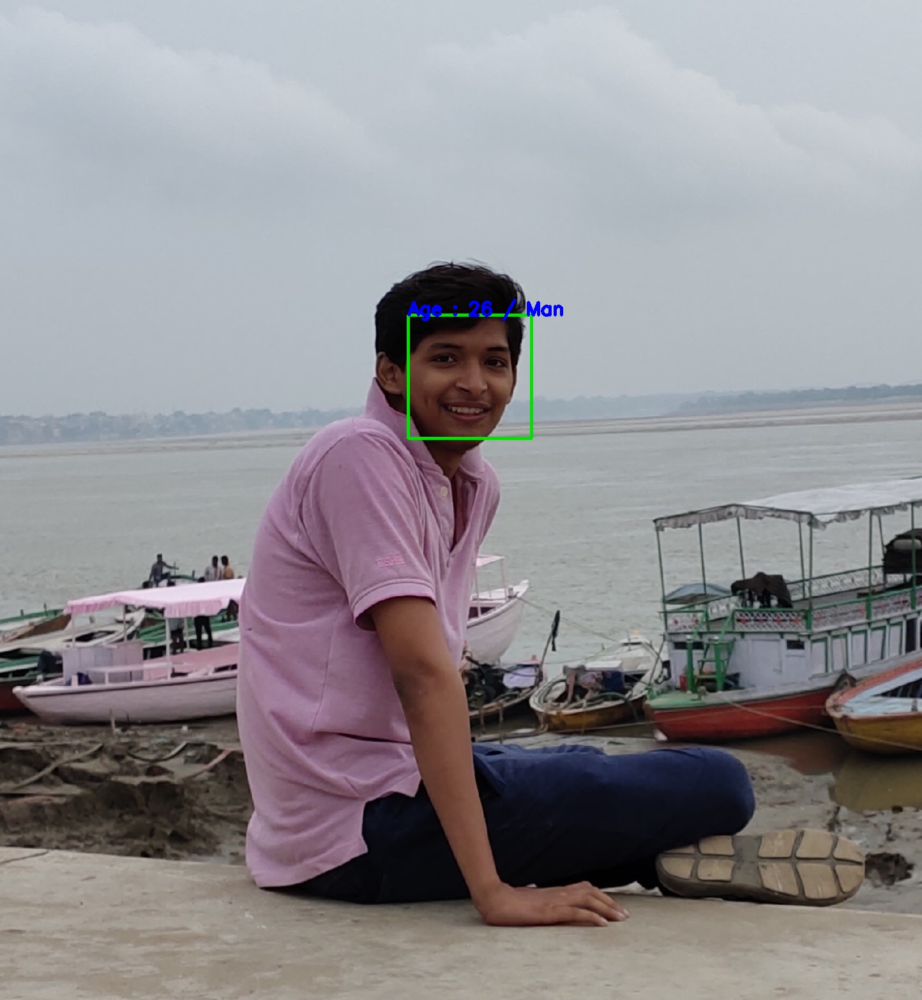
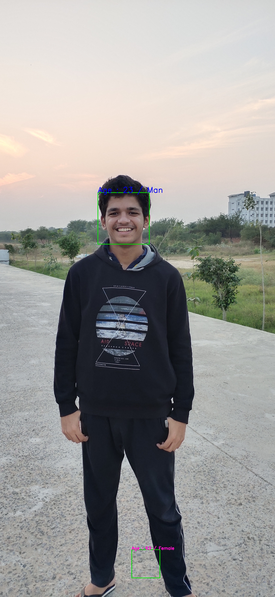

# Age_Gender-Prediction
 Jovac Capstone Project on topic - Age and Gender Prediction (based on ConvNets or other Neural Networks).
# DataSet
  In this project I have used ```UTKFace Dataset``` which can easily be downloaded from kaggle or from the google drive link https://drive.google.com/drive/folders/1ysIb0JHDIXHQ0pTIsn0XePQ7SER1vRQH?usp=sharing 
  ### Example of the DataSet : 
   
  <h3>DataSet Description : </h3>
   UTKFace dataset is a large-scale face dataset with long age span (range from 0 to 116 years old). The dataset consists of over 20,000 face images with annotations of age, gender, and ethnicity. The images cover large variation in pose, facial expression, illumination, occlusion, resolution, etc. This dataset could be used on a variety of tasks, e.g., face detection, age estimation, age progression/regression, landmark localization, etc.
   <h1> Steps to Execute the code :  </h1>
* Clone the github repository in your local PC from the link : https://github.com/VaibhavSrivastava-1110/Age_Gender-Prediction.git <br>
* Open the "Training.ipynb" in your jupyter notebook, and if you want to train the model yourself, then run each cell one by one. <br>
* If you have trained the model yourself then ok, but if you want the model I have trained then download it from this drive link : https://drive.google.com/drive/folders/1ysIb0JHDIXHQ0pTIsn0XePQ7SER1vRQH?usp=sharing <br>
* Now when you have downloaded "model.h5" open the "Test.ipynb" in your jupyter notebook and run each cell one by one for testing the model. <br>
* I have already done it on couple of photos and following are the results : 
   
   
   From the above two images it is clear that gender prediction is having a great accuracy, while age prediction is around 80% accurate. <br>
* For user convenience there is also a ``` Test.py ``` file which can be executed from the command line but beware that you have all the modules imported in that file. <br>
* When you run "Test.py" it will open a file explorer in background, minimize your compiler and choose the file for which you want to test the model, then after the execution is completed, a predicted.jpg will be saved in your cloned folder. Open it to see the results. <br>
<h1>References : </h1> 
1. https://www.geeksforgeeks.org/file-explorer-in-python-using-tkinter <br>
2. https://www.bogotobogo.com/python/OpenCV_Python/python_opencv3_Image_Object_Detection_Face_Detection_Haar_Cascade_Classifiers.php <br>
3. stackoverflow.com <br>
4. https://pytorch.org/tutorials/recipes/recipes/saving_and_loading_models_for_inference.html
5. www.kaggle.com 
<h5> Note that the modules mentioned in "Test.py" are must for executing the code from command line. And if you don't see the explorer open, minimize your compiler to find it. </h5>
